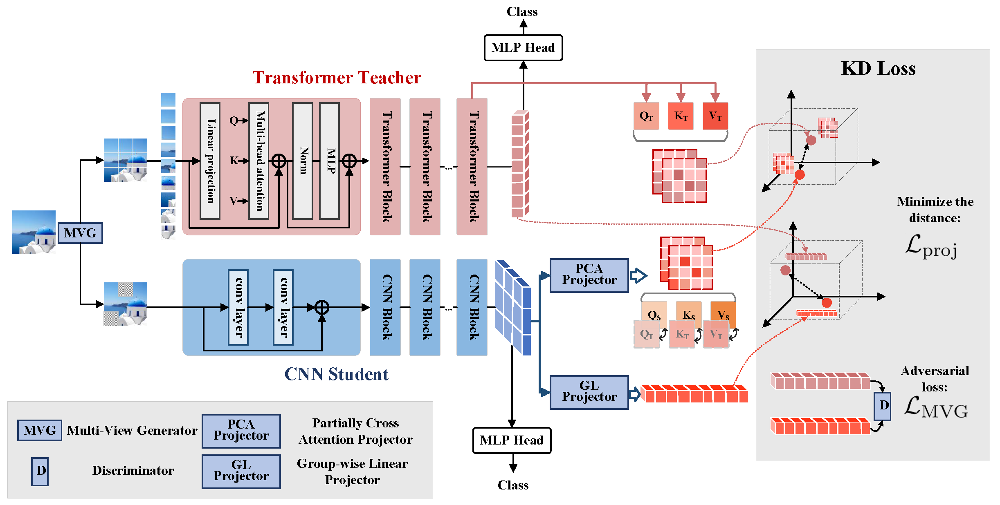

# Cross-Architecture Knowledge Distillation

This is an open source implementation of the paper called "Cross-Architecture Knowledge Distillation":
> Yufan Liu, Jiajiong Cao, Bing Li, Weiming Hu, Jingting Ding, Liang Li. Cross-Architecture Knowledge Distillation. Asian Conference on Computer Vision (ACCV): Long Beach, China. 2022.12.04-2022.12.08.

## Abstract
*Transformer attracts much attention because of its ability to learn global relations and superior performance. In order to achieve higher performance, it is natural to distill complementary knowledge from Transformer to convolutional neural network (CNN). However, most existing knowledge distillation methods only consider homologous-architecture distillation, such as distilling knowledge from CNN to CNN. They may not be suitable when applying to cross-architecture scenarios, such as from Transformer to CNN. To deal with this problem, a novel cross-architecture knowledge distillation method is proposed. Specifically, instead of directly mimicking output/intermediate features of the teacher, partially cross attention projector and group-wise linear projector are introduced to align the student features with the teacherâ˘A ´ Zs in two projected feature spaces. And a multi-view robust training scheme is further presented to improve the robustness and stability of the framework. Extensive experiments
show that the proposed method outperforms 14 state-of-the-arts on both smallscale and large-scale datasets.*

## Framework

## Requirements

- Pytorch

## Usage
Comming soon.

## Experiments

## Contact
If any question, please contact yufan.liu@ia.ac.cn, or use public issues section of this repository.
